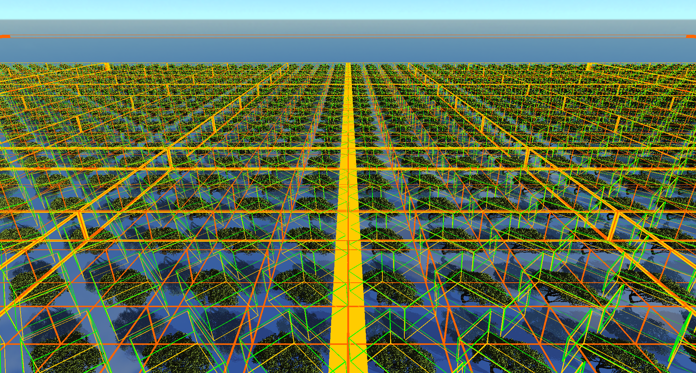
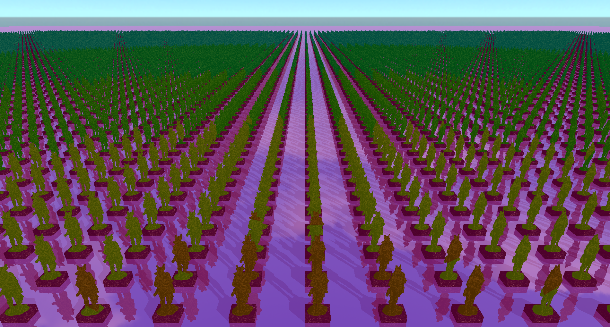
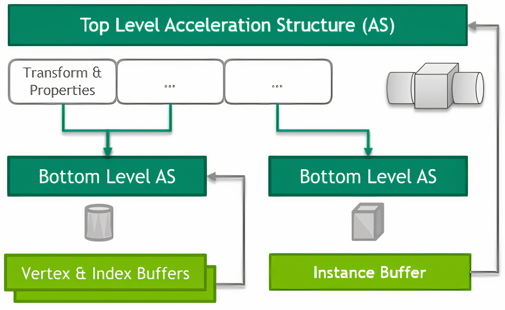

# Traversal-Shader-on-Current-GPUs
A thesis by Markus Hall

## Welcome

I'm Markus and welcome you to the GitHub-Page for my thesis "Traversal shader on current GPUs".
This topic really sparked my interest as I've always been interested in computer graphics.
Due to recommendation of my supervisor, I have decided to publish my results as well as all relevant sources and code.
I will link the relevant directories and sources in here. So, without further delays, let's get into it.

## Abstract

Ever since Nvidia released their RTX GPU family, real time raytracing applications rapidly rose to popularity. 
To allow this, these GPUs feature hardware acceleration for ray traversal. However, acceleration structures are limited to single-level instancing and to a fixed function traversal behavior. This does not allow for techniques like dynamic level of detail that reduces CPU-GPU communication in between frames nor the use of multi-level instancing to reduce scene size on the GPU.
Won-Jong et al. [WJLV19] proposed the insertion of programmable instances into acceleration structures. In this thesis we will use programmable instances to allow for multi-level instancing and dynamic Level-of-Detail by using the Vulkan Raytracing API. This
will allow us to render the Moana Island production asset by Disney in real time while
saving multiple GBs of VRAM.

## Traversal shaders
Traversal shaders are an extension to acceleration-structure traversal. A traversal shader hereby represents a small program, which can control how an acceleration structure (AS) is traversed. This can be used to implement multi-level instancing and dynamic-level of detail, reduce GPU-CPU bandwidth and much more. More information on the general concept can be found in chapter [4.1](https://github.com/Ta1sty/Traversal-Shader-on-Current-GPUs/blob/master/Traversal-Shaders%20on%20current%20GPUs.pdf) or a the paper by [Won-Jong et al.](https://www.intel.com/content/www/us/en/developer/articles/technical/flexible-ray-traversal-with-an-extended-programming-model.html).

### Why use traversal shaders

Traversal shaders offer a couple of improvements to raytracing, especially regarding memory and performance, they also have a couple of niche uses as well.
For this thesis I focused on the two following applications:
  - Multi-level instancing: Traversal of an accelleration structrure behaves like tree traversal, it is possible to specify an acceleration structure as a leaf node of another. In that case we can keep continuing this way as long as we want. Below is an example that explains it.
  - Level-of-Detail: (LoD) is a common practice to reduce performance impact of faraway objects. It swaps the meshes of those objects with lower resolutions and keeps improving resolution as the observer comes closer. In the regular case the selected level of detail must be precalculated before each frame. However, with traversal shader it is possible to select the level of detail dynamically.

Multi-level instancing

  

Level of Detail

  

What else is possible? Well, it is possible to do a lot of hacky things with them, you could teleport the light ray to another position in the scene. Implementing a light-portal in the process. Or you could start to render fractals (Sphereflake) to high depths. You can also use traversal shader to implement a lazy-loading technique for AS that are not visible [(Wong-Jong et al.)](https://www.intel.com/content/www/us/en/developer/articles/technical/lazy-build-of-acceleration-structures.html). They also open a couple of possiblities for moving objects, since you can represent movement by transforming the ray into another position. In this case it is required to adjust sizes of bounding boxes and rebuild less often.

### Current state of architecture 

In a sense, traversal shaders already exist in the current GPU (notably [Nvidia Ampere](https://www.nvidia.com/en-us/data-center/ampere-architecture/) architecture). They are responsible for transforming the ray into the lower AS coordinate system and letting the ray traversal continue there.

However, currently it is required to define which the AS that is traversed next when intersecting during the AS-Build. Additionally, we are limited to single-level instancing. Therefore, the Forest-Tree-Leaf example does not work. We choose this architecture as our starting point and develop a proof of concept by modeling a traversal shader in a GLSL shader.

<a href="https://www.khronos.org/blog/ray-tracing-in-vulkan">Current architecture</a>

  

In Vulkan an AS contains of two levels
- Bottom-Level-AS (BLAS): These AS contain the actual geometry, such as meshes made up by triangles. They may also contain Axis-Aligned-Bounding-Boxes (AABBs). Once a primitive (Triangle, AABB) is intersected, control is returned to the shader to confirm the intersection or to generate a custom intersection point in the case of AABBs (for example for tracing spheres).
- Top-Level-AS (TLAS): Is the entry point for a ray query and spans over instances of BLAS, with each instance having its own transform and properties.

### Walking through a forest

The best example to explain traversal shaders is for a forest of trees with leaves. Hereby the forest, trees and their leaves all have their own acceleration structure.
- Forest AS: Spans over the entire scene and contains trees as instances with different transforms. In this example this could be called the Top-Level-AS (TLAS)
- Tree AS: Contains the geometry for the branches and trunk. It also references the leaves as instanced primitves with different transforms
- Leave AS: Contains the geometry for the leaves

The way traversal works with multi-level instancing is that we start at the root (forest) of the scene graph. We then traverse down the forest until we intersect a tree instance. We then transform the ray into the coordinate system of the tree. There, traversal is continued until either the tree or an instanced leaf is hit. In the latter case we continue by transforming the ray into the coordinate system of a leaf. This is where we either intersect a triangle or we return with a negative, in any case we continue through the tree to find closer intersections in the same manner. Once we are done with the tree, we finish with the forest and see if we can find a closer intersection. The result of the traversal is the closest primitive.

The hierarchy of acceleration structures for a forest

  

## Method
As previously stated, we will emulate the behaviour of a traversal shader in a single GLSL shader. In this program we will make use of [Vulkan-RayQueries](https://www.khronos.org/blog/ray-tracing-in-vulkan).

### Continuing with the forest

On the current architecture the AS-Tree in the example above cannot be represented. Instead, it has to be transformed into the current layout. For this we transform the TLAS:World to a TLAS-BLAS pair, where the BLAS contains the AS for all the trees as AABBs.

The AS tree of the forest in the correct layout

  

### Programmable instances (PIs)

The above example introduces the programmable instance. In the forest scenario, they are responsible for continuing traversal from the World-AS into the Tree-AS. They do that by executing a small program which then tells the shader where to continue traversal. In this case, traversal is continued in the Tree-AS once it has finished with the World-AS.

PI were proposed by [Wong Jong et al.](https://www.intel.com/content/www/us/en/developer/articles/technical/flexible-ray-traversal-with-an-extended-programming-model.html), which is more general. In our case they are basically just instances or AABBs with an attached program that is run once they are intersected. In this program we can add AS to traverse next and transform the ray to our liking. We want these PIs to be referenced between TLAS and BLAS and between BLAS to BLAS. Sadly, we can't do either. What we can do is fake these PIs by flagging our AABBs and running more ray-queries into lower-level TLAS. In this case we only have access to PIs as children of BLAS, which can be seen in the picture above. Different behavior is then implemented by using a couple of if-statements that implement behaviour such as selecting a level of detail based on the AABB-flags.

### Traversal stack and traversal order

Above I described the way traversal continues down a tree. At all traversed levels it is required to keep track of state of traversal inside an acceleration structure. Therefore, traversal requires a stack. Furthermore, GLSL does not support recursion as it does not have a stack, therefore we implement our own.
This gives us the problem that we are unable to run more RayQueries recursively. Instead, we let a RayQuery run to finish and keep track of all intersected PIs. Once finished we loop through them and let them select their AS and add a traversal payload to the stack. Traversal finishes when there are no payloads left in the stack.
There are a couple of things that can be optimized:
- Order of added stack payloads: It makes sense that the first intersected PI should be the first to traverse next, as the RayQuery gives us the closer AABB intersections first.
- Skipping payloads: with each payload we can associate a lower bound for any intersection inside its AABB, therefore we can skip payloads if we already found a closer hit.

Thus, a payload need to keep track of:
- Transformation: Used to transform the ray into object space and surface normal back to world space
- tNear: the closest intersection point possible inside the AABB
- selected AS: the TLAS to traverse next

We can now go about implementing the different behavior such as level of detail

### Implementing Dynamic-LOD

Since the PIs are nothing but AABBs with flagged behavior, we can execute any code we want. This allows to select the LOD based on the distance of the AABB to the observer by projecting the AABB onto the screen and selecting the LOD based on the projection size. We then just add the selected LOD to the traversal stack and let traversal resume.

## Evaluation

Performance was test in 3 different fields:
1. Level of detail
2. Multi-level instancing
3. [Moana island](https://disneyanimation.com/resources/moana-island-scene/)

The latter of the three was a test to showcase usability in a real world example. Every scene was rendered using only raytracing, with primary, shadow, transmission and reflection rays on an RTX3060 with a resolution of 1920x1080.

### Level of detail

For level of detail, we tested on a 2 million triangle statue which was instanced 16395 times with 6 levels of detail. Each level reduced triangle count by a factor of 4. We had three cases to test:
- NO-LOD: no levels of detail used, instead all meshes are instanced in one acceleration structure this the ground mark
- Overhead - in this scenario the same scene was rendered with always the highest level chosen, this was to evaluate the overhead the traversal shader has
- Dynamic LOD - here we used dynamic LOD to see if it was possible to achieve an improvement over no LOD

As for the results, the overhead test showed that there is a significant cost that comes from using multiple ray queries per pixel, however with dynamic level of detail it was possible to achieve a gain in FPS over NO-LOD. Overall, there also was an improvement in cache efficiency.

### Multi-level instancing
In this test I picked a tree form moana island and instanced it so many times until Vulkan did not allow for more instances in an acceleration structure.
Then the same scene was rendered with traversal shaders using multi-level instancing. This test yielded an over 90% improvement in VRAM. However, the amount of FPS lost was also very significant with more than 50%. To test the limits of traversal shaders, the entire scene was instanced over and over a couple of times. This resulted in a scene with an effective triangle count of 10 quintillion running at 13 FPS.

### Moana island
This case tested the applicability of traversal shaders mixed with traditional rendering. Moana island was a good candidate for that as it featured a lot of single instanced meshes with a couple of multi-instanced bushes. For this test, as much geometry was rendered as could fit and it ended up at about 14 million instanced with a total triangle count of 22 billion. This yielded the following results:
The scene in single level instancing used almost all VRAM available (11GBs). Most notably the acceleration structures occupied over 80% of VRAM. With multi-level instancing however, this decreased significantly by more than 5GBs (50%+) with only a minimal performance impact.

The geometry render of moana island

  

## Discussion

### Results summary

In these scenarios traversal shaders showed that they do indeed work and are able to implement the mentioned concepts. Furthermore, they show a more than significant decrease in memory usage and a slight improvement in cache efficiency. On the other side, they also introduce a heavy overhead as they keep switching control between raytracing core and the streaming multiprocessor.

### Applications
Traversal shader are a huge addition to any production or render software which uses raytracing and must not fulfill real time requirements. They are perfect for objects like trees and houses which have multiple shared submeshes like leavs, walls, rooms etc. LOD can be used to some extent and does offer some improvements, though one must be careful where to use it. They may also be useful for some niche uses that I mentioned earlier, specifically the reduced amount of rebuilds and lazy loading of AS.

### Drawbacks
Overall traversal should only continue up to 3 levels of instancing otherwise the overhead starts to take over. Current GPUs are currently not designed for this many control switches as RT-Core and SM control switches take most of the shader time and overall the cache efficiency does not look to great for AS that are in the dimensions of multiple GBs. Though, using traversal shaders they do improve a little, since less instances are used.

### Outlook
If something along the lines comes of hardware support for traversal shaders comes, then I would see some real promise. It isn't even necessary to support traveral shaders in full generality. Just the injection of a program to select a single acceleration structure to traverse next, would be enough to allow for almost all techniques. More generally speaking it would definetly be beneficial for reduced latency for any control switches for ray queries in any program. Overall, I was astonished at the decrease in memory usage by multi instancing a couple of bushes and that it had next to no performance impact.

### Thanks
That is all for now. I am currently working privately on another raytracer with Vulkan where I will incorporate a traversal shader to some degree. And depending on the results I might publish that repository as well. My thanks go out to all people who helped me, all the nice tutorials and the public repositories out there. You can find these at the end of the Pdf in subsection 6.5.

I sincerely thank you for reading. 

